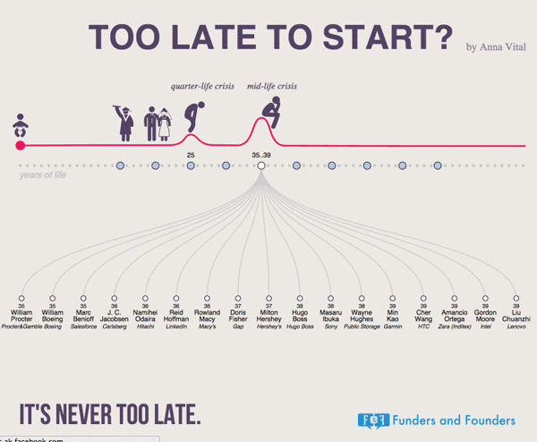

Lorem ipsum dolor sit amet, consectetur adipiscing elit

## Lorem ipsum dolor sit amet

Looking at the biographies of top 100 founders on the Forbes Global Companies List shows that 35 is the most common age to start one of the top companies in the world. We excluded the companies that were inherited from previous ones, and the companies where governments were heavily involved.
We combined timeline and tree to categorize founders by age

**Tech**: D3.js, OpenRefine, Freebase

**Scope**: development, data crunching, information design

[Explore the project](https://blog.adioma.com/too-late-to-start-life-crisis-infographic/)