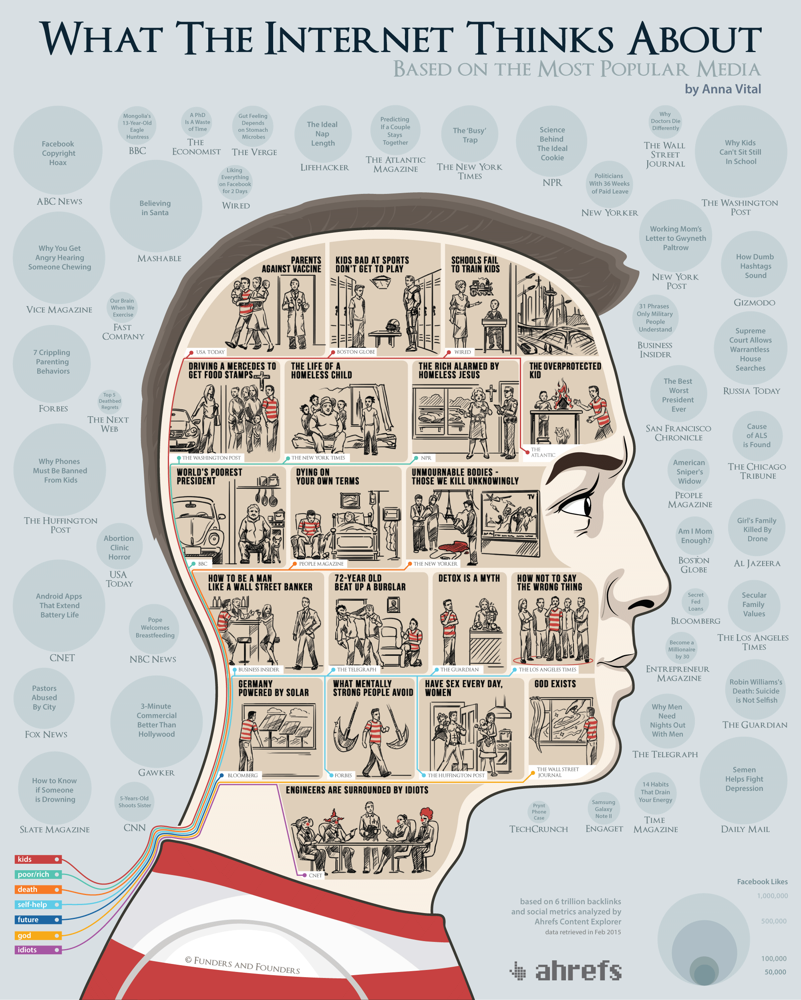

Interactive visualization of the most-shared articles on the internet based on Ahrefs dataset.

**Tech**: JavaScript, D3.js, SVG, CSS animation

**Scope**: development, data crunching

[Explore the project](https://blog.adioma.com/what-internet-thinks-based-on-media-infographic/)
